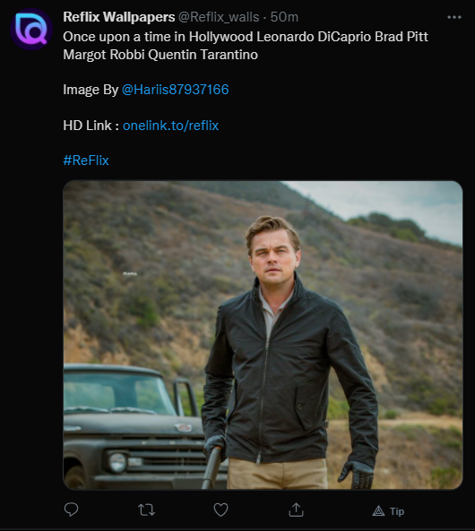

# Twitter Bot

This is a twitter bot that randomly selects Pictures from my favorite Flickr Accounts and posts them, along with some metadata, to Twitter It runs entirely within GitHub via [GitHub Actions](https://github.com/features/actions) and has no external dependencies except the Twitter API.

## Example

## Active Accounts

- **[Reflix Wallpapers](https://twitter.com/Reflix_walls)** 

## Content Licensing

I believe all images used falls under the remits of Fair use. It is not my intent to in any way infringe on their content ownership. I'm using them for a noncommercial purpose so it's presumed that this use is allowable. Please contact me if this is inaccurate and I'm happy to remove any photos from the content archives.

## Cost

GitHub Actions are entirely free for public repositories. All of the data the bot fetches from is also stored in GitHub, either in a repository or as [Gists](https://gist.github.com/). Running this code is entirely cost free. Additionally, I make no money from the bot.

